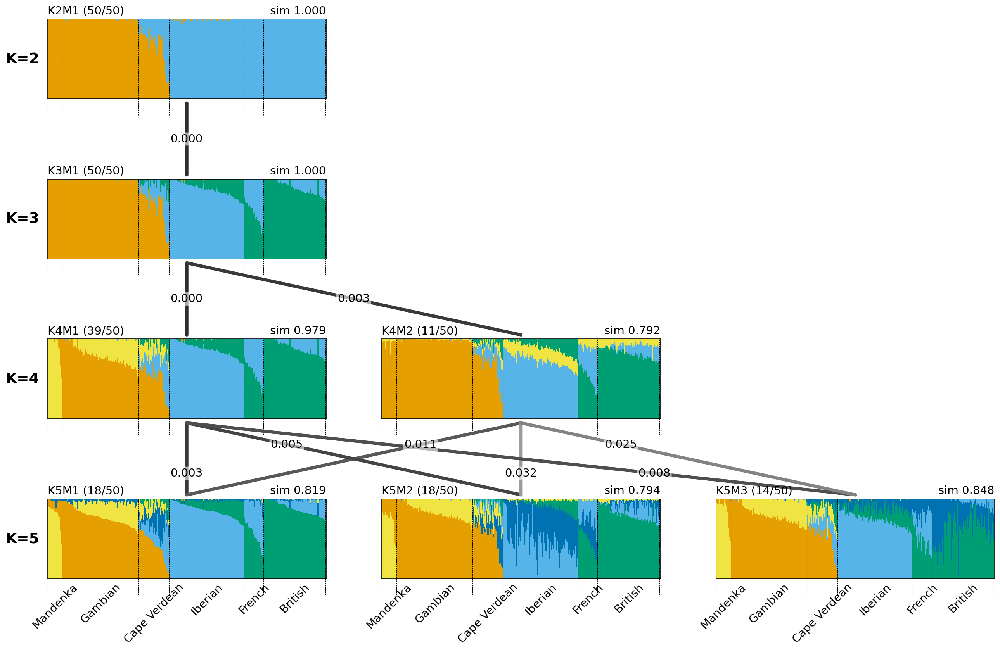
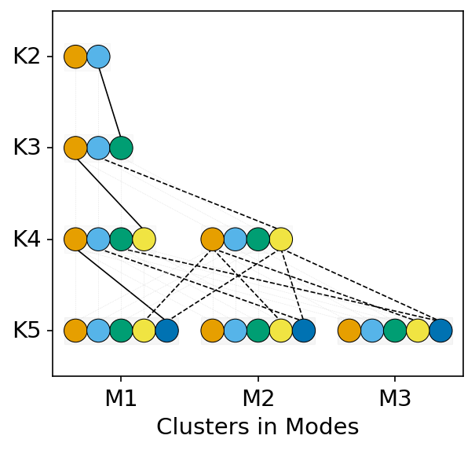

# Clumppling

This is the GitHub repository for the program ***Clumppling*** (CLUster Matching and Permutation Program that uses integer Linear programmING), a framework for aligning mixed-membership clustering results of population structure analysis.

Current version **v 1.5.1** (Last update: Nov 20, 2025)

This README provides a quick-start guide for installation and use. See the [software manual](Clumppling_Manual.pdf) for full details.

**Refer to [this tutorial](https://github.com/PopGenClustering/popstru-cls-align-vis-workflow) for a brief guide on running an end-to-end analysis, including data preparation, population structure analysis, cluster alignment (using *Clumppling*), and visualization.**

## Feature Highlights

- Flexible input parsing compatible with popular ancestry inference softwares like *STRUCTURE* and *ADMIXTURE*.
- Clustering alignment within and across various K values (i.e., the number of ancestries).
- Mode detection in clustering results for identifying and summarizing distinct solutions.
- Visualization of alignment patterns and aligned modes in a connected graph layout.
- Modular design for easy integration.

## Usage

**There are two ways to run *Clumppling*.**
1. You can run it **remotely** on the server, which **does not require downloading or installing** the program locally. The remote version provides the core functionalities of the program. Check out the [Remote Notebook](#Remote-Notebook) section.
2. You can download and install the Python package onto your local machine and run the program **locally**. The local version provides an extended list of functionalities (see [the pdf Manual](Clumppling_Manual.pdf) for details). Check out the [Local Installation](#Local-Installation) section.

---
## Remote Notebook
The remote version is available through an **online Colaboratory notebook**, which is a Jupyter notebook that runs in the cloud served by Google. If you are interested, more details about Colab notebooks can be found at https://colab.google/.

There is **no need to download and install the program locally**.

To **run *Clumppling* remotely**, click on [**THIS LINK**](online_notebook_for_clumppling.ipynb)) which will bring you to the notebook. Next, open the notebook in Colab and follow the instructions in the notebook. 

One by one, Click the run (little round-shaped buttons with a triangle in the middle) buttons next to each block on the left. 

Upload input files (e.g., the example files provided [here](examples)) as a zip folder, specify the input data format, and change input parameters (if needed) following the instructions. 

You will be able to download a zipped file containing the alignment results at the end of the notebook.

---
## Local Installation
The local version requires downloading and installing the program to your local machine. 

### 1. Use a **command line interpreter** (i.e., a shell)
   * Linux and macOS users can use the **built-in Terminal**. 
   * For Windows users, you will need to obtain a terminal. For example: 
     - After you follow Step 3 to install Conda, you can use the built-in *Anaconda Prompt* available from the Anaconda Navigator. Note that the installation of Python and Conda on Windows only requires running the installers and there is no need for running commands in the command window.
     - You may also use the built-in (for Windows 10) [*Windows PowerShell*](https://learn.microsoft.com/en-us/windows-server/administration/windows-commands/powershell). 
     - Or, you can use *Git Bash* after you install Git by downloading and running the executable Git installer from https://git-scm.com/download/win.

### 2. Install **Python** (Version >=3.9,<3.13)
   You can download the Python installer from https://www.python.org/downloads/.
   * For **Windows** users, go to https://www.python.org/downloads/windows/ to download the installer corresponding to your operating system, e.g., Windows installer (64-bit). Run the executable installer and check the box 'Add Python to environment variables' during the installation.
   * For **macOS** users, go to https://www.python.org/downloads/macos/ to download the macOS 64-bit universal2 installer and double-click on the *python-<version>-macosx.pkg* file to start the Python installer.
   * For **Linux** users, if Python is not pre-installed, you can install it via command lines (``sudo yum install -y python3`` for CentOS and Red Hat Linux and ``sudo apt-get install python3`` for all other Linux systems). 
   
   You can verify the installation by running 
   ````
   python --version
   ```` 
   in the command line interpreter, which should give you the version of the installed Python (>=3.9,<3.13 required).

### 3. Install conda and create a virtual environment 
   Go to https://www.anaconda.com/download to download the conda installer and run the installer. Conda is a popular package management system and environment management system.
   
   > A virtual environment is a Python environment such that the Python interpreter, libraries and scripts installed into it are isolated from those installed in other virtual environments, and (by default) any libraries installed in a “system” Python, i.e., one which is installed as part of your operating system"
   
   Using a virtual environment helps to keep the dependencies required by different projects separate and to avoid conflicts between projects. 
   
   Create a virtual environment named ``clumppling-env`` (feel free to specify your own name) by typing the following command in the command-line interpreter
   ````
   conda create -n clumppling-env python=3.12
   ````
   Activate the virtual environment by
   ````
   conda activate clumppling-env 
   ````
### 4. Install the *Clumppling* package 
   **(1) Install the package**  

   Usually, pip is automatically installed when you installed Python. If it is not yet available in the system, follow the instructions from [https://pip.pypa.io/en/stable/installation/](https://pip.pypa.io/en/stable/installation/) to install it.
   
   Then run the following command to install the package:
   ````
   pip install clumppling
   ````
   
   > **Alternatively**, you may choose to install the package in one of the two other ways: 
   >
   > If you have [Git](https://git-scm.com/) installed, run ```pip install git+https://github.com/PopGenClustering/Clumppling```.
   > 
   > If you don't have Git, run ```pip install https://github.com/PopGenClustering/Clumppling/archive/master.zip```.

   **(2) Download the example files from [the examples directory](examples) in the GitHub repository** \
   For each zipped example dataset, unzip the files into a folder with the same name as the zip file, and put it inside a folder called "input" under a path of your choice. 
   
   More will be discussed in the section *How to run (with example data)*.

### 5. Check whether the installation is successful
Run the following command:
   ````bash
   python -m clumppling -h
   ````
If the installation was successful, you should see the usage of the program in the command window. The usage tells you the required and optional arguments to the program. It should look like:
````bash
usage: __main__.py [-h] -i INPUT -o OUTPUT -f {generalQ,admixture,structure,fastStructure} [-v VIS]
                   [--custom_cmap CUSTOM_CMAP] [--plot_type {graph,list,withinK,major,all}] [--include_cost INCLUDE_COST]
                   [--include_label INCLUDE_LABEL] [--alt_color ALT_COLOR] [--ind_labels IND_LABELS]
                   [--ordered_uniq_labels ORDERED_UNIQ_LABELS] [--regroup_ind REGROUP_IND]
                   [--reorder_within_group REORDER_WITHIN_GROUP] [--reorder_by_max_k REORDER_BY_MAX_K]
                   [--order_cls_by_label ORDER_CLS_BY_LABEL] [--plot_unaligned PLOT_UNALIGNED]
                   [--fig_format {png,jpg,jpeg,tif,tiff,svg,pdf,eps,ps,bmp,gif}] [--extension EXTENSION]
                   [--skip_rows SKIP_ROWS] [--remove_missing REMOVE_MISSING]
                   [--cd_method {louvain,leiden,infomap,markov_clustering,label_propagation,walktrap,custom}]
                   [--cd_res CD_RES] [--test_comm TEST_COMM] [--comm_min COMM_MIN] [--comm_max COMM_MAX] [--merge MERGE]
                   [--use_rep USE_REP] [--use_best_pair USE_BEST_PAIR]

Clumppling: a tool for cluster matching and permutation program with integer linear programming

required arguments:
  -i INPUT, --input INPUT
                        Input file path
  -o OUTPUT, --output OUTPUT
                        Output file directory
  -f {generalQ,admixture,structure,fastStructure}, --format {generalQ,admixture,structure,fastStructure}
                        File format

optional arguments:
  -v VIS, --vis VIS     Whether to generate figure(s): True (default)/False
  --custom_cmap CUSTOM_CMAP
                        A plain text file containing customized colors (one per line; in hex code): if empty (default),
                        using the default colormap, otherwise use the user-specified colormap
  --plot_type {graph,list,withinK,major,all}
                        Type of plot to generate: 'graph' (default), 'list', 'withinK', 'major', 'all'
  --include_cost INCLUDE_COST
                        Whether to include cost values in the graph plot: True (default)/False
  --include_label INCLUDE_LABEL
                        Whether to include individual labels in the plot: True (default)/False
  --alt_color ALT_COLOR
                        Whether to use alternative colors for connection lines: True (default)/False
  --ind_labels IND_LABELS
                        A plain text file containing individual labels (one per line) (default: last column from labels in
                        input file, which consists of columns [0, 1, 3] separated by delimiter)
  --ordered_uniq_labels ORDERED_UNIQ_LABELS
                        A plain text file containing ordered unique individual labels (one per line) to specify the order
                        of grouped labels (default: based on first-seen order from ind_labels)
  --regroup_ind REGROUP_IND
                        Whether to regroup individuals so that those with the same labels stay together (if labels are
                        available): True (default)/False
  --reorder_within_group REORDER_WITHIN_GROUP
                        Whether to reorder individuals within each label group in the plot (if labels are available): True
                        (default)/False
  --reorder_by_max_k REORDER_BY_MAX_K
                        Whether to reorder individuals based on the major mode with largest K: True (default)/False (based
                        on the major mode with smallest K)
  --order_cls_by_label ORDER_CLS_BY_LABEL
                        Whether to reorder clusters based on total memberships within each label group in the plot: True
                        (default)/False (by overall total memberships)
  --plot_unaligned PLOT_UNALIGNED
                        Whether to plot unaligned modes (in a list): True/False (default)
  --fig_format {png,jpg,jpeg,tif,tiff,svg,pdf,eps,ps,bmp,gif}
                        Figure format for output files (default: tiff)
  --extension EXTENSION
                        Extension of input files
  --skip_rows SKIP_ROWS
                        Skip top rows in input files
  --remove_missing REMOVE_MISSING
                        Remove individuals with missing data: True (default)/False
  --cd_method {louvain,leiden,infomap,markov_clustering,label_propagation,walktrap,custom}
                        Community detection method to use (default: louvain)
  --cd_res CD_RES       Resolution parameter for the default Louvain community detection (default: 1.0)
  --test_comm TEST_COMM
                        Whether to test community structure (default: True)
  --comm_min COMM_MIN   Minimum threshold for cost matrix (default: 1e-6)
  --comm_max COMM_MAX   Maximum threshold for cost matrix (default: 1e-2)
  --merge MERGE         Whether to merge two clusters when aligning K+1 to K (default: True)
  --use_rep USE_REP     Use representative modes (alternative: average): True (default)/False
  --use_best_pair USE_BEST_PAIR
                        Use best pair as anchor for across-K alignment (alternative: major): True (default)/False
````

## Usage
Examples:
````bash
python -m clumppling \
        -i INPUT_PATH \
        -o OUTPUT_PATH \
        -f generalQ \
        --extension .Q # if not specified, all files under INPUT_PATH will be treated as input files
````

## Example Outputs
<p align="center">


</p>

## Main Function

### Input arguments
The main module takes in three required arguments and several optional ones. The required arguments are
* ``-i`` (``--input``) path to load input files
* ``-o`` (``--output``) path to save output files
* ``-f`` (``--format``) input data format. This choice must be one of "generalQ", "admixture", "structure", or "fastStructure".

The optional arguments are 
* for input parsing: ``extension``, ``skip_rows``, ``remove_missing``
* for community detection: ``cd_method``,  ``cd_res``, ``test_comm``, ``comm_min``, ``comm_max``
* for alignment across-K: ``merge``, ``use_rep``,``use_best_pair``
* for figure generation: ``-v`` (``--vis``), ``plot_type``,``include_cost``, ``include_label``, ``ind_labels``, ``custom_cmap``, ``reorder_ind``, ``regroup_ind``, ``ordered_uniq_labels``, ``reorder_by_max_k``, ``order_cls_by_label``, ``plot_unaligned``, ``fig_format``.

See the above helper message from ``clumppling -h'' for usage of each argument. 

### Example data
As a quick start, let's use the [Cape Verde data](https://doi.org/10.1016/j.cub.2017.07.002) and the [chicken data](https://doi.org/10.1093/genetics/159.2.699) as examples. The data files are available in the zip files [examples/capeverde.zip](examples/capeverde.zip) and [examples/chicken.zip](examples/chicken.zip) under "examples/".

#### Cape Verde data
The *.indivq* files for Cape Verde data contains the column indicating their population indices. Rows in a *.indivq* file with *K=5* clusters (ancestries) look like:
````
5 HGDP00908 (0) 1 : 0.000010 0.000010 0.999960 0.000010 0.000010
6 HGDP00909 (0) 1 : 0.000010 0.000010 0.999960 0.000010 0.000010
7 HGDP00910 (0) 1 : 0.311649 0.000010 0.688321 0.000010 0.000010
````
where the columns represent the individual index (`5`), the individual label (`HGDP00908`), the missing rate (`(0)`), the population index (`1`), and the clustering memberships (after colon). 

The Cape Verde data is also available in **general Q format** (*.Q* files) in [examples/capeverde_admixtureQ.zip](examples/capeverde_admixtureQ.zip). For the same rows as above, in a *.Q* file they look like:
````
0.000010 0.000010 0.999960 0.000010 0.000010
0.000010 0.000010 0.999960 0.000010 0.000010
0.311649 0.000010 0.688321 0.000010 0.000010
````

The corresponding population labels of the Cape Verde individuals are provided separately in the file [examples/capeverde_ind_labels.txt](examples/capeverde_ind_labels.txt).

#### Chicken data
The chicken data is available as the output file format of (*STRUCTURE*)[https://web.stanford.edu/group/pritchardlab/structure.html] software (*_f* files). The clustering memberships are reported in the section starting with
````
Inferred ancestry of individuals:
        Label (%Miss) Pop:  Inferred clusters
  1   0004_1    (0)    4 :  0.001 0.002 0.002 0.001 0.001 0.002 0.001 0.001 0.002 0.001 0.001 0.002 0.003 0.005 0.001 0.972 0.001 
  2   0004_3    (0)    4 :  0.001 0.001 0.002 0.001 0.001 0.002 0.001 0.001 0.002 0.002 0.001 0.002 0.003 0.005 0.002 0.971 0.001 
  3   0004_6    (3)    4 :  0.002 0.001 0.002 0.001 0.001 0.001 0.001 0.001 0.001 0.002 0.002 0.003 0.002 0.003 0.004 0.969 0.004 
````
where the content format pretty much resembles that of the *.indivq* file. Other sections in the structure file is not required neither utilized by *Clumppling*.

A file with custom colors is also provided at [examples/custom_colors.txt](examples/custom_colors.txt) for use in examples.

### How to run (with example data)
1. **Ensure that the data files have been successfully downloaded and put under the right directory.** 
Download the example files from [the directory "examples"](examples) in the GitHub repository. For each example dataset, unzip the files into the folder with the same name as the zip file. 
   
2. **Ensure that the current path is the correct directory.** By default, you should be in the parent directory of the "examples" folder, i.e., in your command-line interpreter, make sure that you navigate to the directory where the folder "exmaples" is located. Alternatively, update the paths correspondingly in the following example scripts.

3. **Run the program** on the Cape Verde data under the default setting, with user-provided individual labels:

    ````bash
    python -m clumppling \
    -i examples/capeverde \
    -o examples/capeverde_output \
    -f admixture \
    --extension .indivq \
    --ind_labels examples/capeverde_ind_labels.txt
    ````

    The outputs will be saved in "examples/capeverde_output" under your current directory and a zipped file of the same name will also be generated and zipped in ``examples/capeverde_output.zip``.

    Similarly, you can run the program on the chicken data as follows:

    ````bash
    python -m clumppling \
    -i examples/chicken \
    -o examples/chicken_output \
    -f structure \
    --extension _f \
    --plot_type all \
    --use_best_pair F \
    --custom_cmap examples/custom_colors.txt 
    ````

    The outputs will be saved in "examples/chicken_output" under your current directory and a zipped file of the same name will also be generated and zipped in ``examples/chicken_output.zip``.
    
These commands are also provided in the [example script for running Clumppling on Cape Verde data (Admixture .indviq files)](examples/align_capeverde.sh) and [example script for running Clumppling on chicken data (Structure _f files)](examples/align_chicken.sh). 


### Outputs
The output folder will contain the following structure (see `examples/capeverde_output` for reference after finishing running the example; suppose `use_rep=True`):

```
output/
├── input/
│   ├── input_meta.txt
│   ├── input_labels.txt (optional)
│   ├── 1_K2R1.Q
│   └── ...
├── alignment_withinK/
│   ├── K2.txt
│   ├── K3.txt
│   └── ...
├── modes/
│   ├── mode_alignment.txt
│   ├── mode_stats.txt
│   ├── mode_average_stats.txt
│   ├── K2M1_avg.Q
│   ├── K2M1_rep.Q
│   └── ...
├── modes_aligned/
│   ├── all_modes_alignment_rep.txt
│   ├── K2M1_rep.Q
│   └── ...
├── alignment_acrossK/
│   ├── alignment_acrossK_rep.txt
│   ├── best_pairs_acrossK_rep.txt
│   └── major_pairs_acrossK_rep.txt
├── visualization/
│   ├── colorbar.tiff
│   ├── alignment_pattern_graph_rep.tiff
│   ├── all_modes_graph_rep.tiff
│   └── ...
└── clumppling.log
```

- `aligned_modes/`: Contains files with clusters aligned within each K.
- `modes/`: Contains detected modes for each K.
- `acrossK_alignment/`: Contains results of cluster alignment across different K values.
- `plots/`: Contains generated visualizations (structure plots, alignment graphs).
- `logs/`: Contains log files from the run.

File names and subfolders may vary depending on your input and options.

## Submodules

Each submodule is callable independently.

### `parseInput`

``clumppling.parseInput``: Handles reading and parsing input files containing clustering results. Supports various formats and prepares data for downstream analysis.

**Usage:**
````bash
usage: __main__.py [-h] -i INPUT -o OUTPUT -f {generalQ,admixture,structure,fastStructure} [--extension EXTENSION] [--skip_rows SKIP_ROWS]
                   [--remove_missing REMOVE_MISSING]

clumppling.parseInput

options:
  -h, --help            show this help message and exit
  -i INPUT, --input INPUT
                        Input file path
  -o OUTPUT, --output OUTPUT
                        Output file directory
  -f {generalQ,admixture,structure,fastStructure}, --format {generalQ,admixture,structure,fastStructure}
                        File format
  --extension EXTENSION
                        Extension of input files
  --skip_rows SKIP_ROWS
                        Skip top rows in input files
  --remove_missing REMOVE_MISSING
                        Remove individuals with missing data: True/False
````


**Example:**
````bash
python -m clumppling.parseInput \
-i examples/submodules/input \
-o examples/submodules/output \
-f generalQ 
````

### `alignWithinK`

``clumppling.alignWithinK``: Aligns clusters within a single value of K to ensure consistent labeling and facilitate comparison across replicates.

**Usage:**
````bash
usage: __main__.py [-h] [--qfiles [QFILES ...]] [--qfilelist QFILELIST] -o OUTPUT

clumppling.alignWithinK

options:
  -h, --help            show this help message and exit
  --qfiles [QFILES ...]
                        List of Q files to align, passed as command-line arguments
  --qfilelist QFILELIST
                        A plain text file containing Q file names (one per line).
  -o OUTPUT, --output OUTPUT
                        Output file name
````

**Example:**
````bash
python -m clumppling.alignWithinK \
--qfilelist examples/submodules/K3.qfilelist \
-o examples/submodules/K3_aligned.txt

python -m clumppling.alignWithinK \
--qfilelist examples/submodules/K5.qfilelist \
-o examples/submodules/K5_aligned.txt
````

### `detectMode`

``clumppling.detectMode``: Detects modes (distinct clustering solutions) among multiple runs for a given K, helping to identify stable and alternative solutions.

**Usage:**
````bash
usage: __main__.py [-h] --align_res ALIGN_RES --qfilelist QFILELIST -o OUTPUT [--qnamelist QNAMELIST]
                   [--cd_method {louvain,leiden,infomap,markov_clustering,label_propagation,walktrap,custom}] [--cd_res CD_RES] [--test_comm TEST_COMM]
                   [--comm_min COMM_MIN] [--comm_max COMM_MAX]

clumppling.alignWithinK

options:
  -h, --help            show this help message and exit
  --align_res ALIGN_RES
                        Path to the alignment results file
  --qfilelist QFILELIST
                        A plain text file containing Q file names (one per line).
  -o OUTPUT, --output OUTPUT
                        Output file directory
  --qnamelist QNAMELIST
                        A plain text file containing replicate names (one per line) (default: file base from qfilelist)
  --cd_method {louvain,leiden,infomap,markov_clustering,label_propagation,walktrap,custom}
                        Community detection method to use (default: louvain)
  --cd_res CD_RES       Resolution parameter for the default Louvain community detection (default: 1.0)
  --test_comm TEST_COMM
                        Whether to test community structure (default: True)
  --comm_min COMM_MIN   Minimum threshold for cost matrix (default: 1e-4)
  --comm_max COMM_MAX   Maximum threshold for cost matrix (default: 1e-2)
````

**Example:**
````bash
python -m clumppling.detectMode \
--align_res examples/submodules/K3_aligned.txt \
--qfilelist examples/submodules/K3.qfilelist \
--qnamelist examples/submodules/K3.qnamelist \
--cd_method markov_clustering \
-o examples/submodules/K3_modes

python -m clumppling.detectMode \
--align_res examples/submodules/K5_aligned.txt \
--qfilelist examples/submodules/K5.qfilelist \
--qnamelist examples/submodules/K5.qnamelist \
--cd_method markov_clustering \
-o examples/submodules/K5_modes
````

### `alignAcrossK`

``clumppling.alignAcrossK``: Aligns clusters across different values of K, enabling tracking of cluster membership changes as K varies.

**Usage:**
````bash
usage: __main__.py [-h] [--qfilelist QFILELIST] -o OUTPUT [--qnamelist QNAMELIST] [--use_best_pair USE_BEST_PAIR]

clumppling.alignAcrossK

options:
  -h, --help            show this help message and exit
  --qfilelist QFILELIST
                        A plain text file containing Q file names (one per line).
  -o OUTPUT, --output OUTPUT
                        Directory to save output files
  --qnamelist QNAMELIST
                        A plain text file containing replicate names (one per line) (default: file base from qfilelist)
  --use_best_pair USE_BEST_PAIR
                        Use best pair as anchor for across-K alignment (alternative: major): True (default)/False
````

**Example:**
````bash
# prepare mode files
for K in 3 5; do
    SRC=examples/submodules/K${K}_modes
    DST=examples/submodules/K3K5_modes
    mkdir -p $DST
    for f in "$SRC"/*.Q; do
        if [ -f "$f" ]; then
            cp "$f" "$DST/K${K}$(basename "$f")"
        fi
    done
done
# generate list of mode files and names
ls examples/submodules/K3K5_modes/*_rep.Q > examples/submodules/K3K5_modes/K3K5_modes.qfilelist
for f in examples/submodules/K3K5_modes/*_rep.Q; do [ -f "$f" ] && basename "$f" | sed 's/\_rep.Q$//' >> examples/submodules/K3K5_modes/K3K5_modes.qnamelist; done

# run clumppling
python -m clumppling.alignAcrossK \
--qfilelist examples/submodules/K3K5_modes/K3K5_modes.qfilelist \
--qnamelist examples/submodules/K3K5_modes/K3K5_modes.qnamelist \
-o examples/submodules/K3K5_acrossK_output
````

### Visualizations
For generating figures, see [examples/plot_submodules.py](examples/plot_submodules.py) as an example of visualizing the results from [examples/submodules/K3K5_acrossK_output](examples/submodules/K3K5_acrossK_output) in different ways. 

Run
````bash
python examples/plot_submodules.py 
````

All commands are also provided in [examples/run_submodules.sh](examples/run_submodules.sh). 


### `compModels`

``clumppling.compModels``: Compares clustering results from different models, with potentially different K values for the results of each model.

**Usage:**
````bash
usage: __main__.py [-h] --models MODELS [MODELS ...] --qfilelists QFILELISTS [QFILELISTS ...] [--qnamelists QNAMELISTS [QNAMELISTS ...]]
                   [--mode_stats_files MODE_STATS_FILES [MODE_STATS_FILES ...]] -o OUTPUT [-v VIS] [--custom_cmap CUSTOM_CMAP]

clumppling.compModels

options:
  -h, --help            show this help message and exit
  --models MODELS [MODELS ...]
                        List of model names.
  --qfilelists QFILELISTS [QFILELISTS ...]
                        List of files containing Q file names from each model.
  --qnamelists QNAMELISTS [QNAMELISTS ...]
                        List of files containing replicate names from each model.
  --mode_stats_files MODE_STATS_FILES [MODE_STATS_FILES ...]
                        List of files containing mode statistics from each model.
  -o OUTPUT, --output OUTPUT
                        Output file directory
  -v VIS, --vis VIS     Whether to generate figure(s): True (default)/False
  --custom_cmap CUSTOM_CMAP
                        A plain text file containing customized colors (one per line; in hex code): if empty (default), using the default colormap, otherwise use
                        the user-specified colormap
````

**Example:**
````bash
python -m clumppling.compModels \
--models ${model1} ${model2} \
--qfilelists examples/comp_models/${model1}.qfilelist examples/comp_models/${model2}.qfilelist \
--qnamelists examples/comp_models/${model1}.qnamelist examples/comp_models/${model2}.qnamelist \
--output examples/comp_models/capeverde_comp_${model1}_vs_${model2} 
````

Example: see [examples/run_comp_models.sh](examples/run_comp_models.sh). 


## License

MIT License

## References
*Liu, X., Kopelman, N. M., & Rosenberg, N. A. (2024). Clumppling: cluster matching and permutation program with integer linear programming. Bioinformatics, 40(1), btad751. [https://doi.org/10.1093/bioinformatics/btad751](https://doi.org/10.1093/bioinformatics/btad751)*

The Cape Verde data used as the example comes from: \
*Verdu, P., Jewett, E. M., Pemberton, T. J., Rosenberg, N. A., & Baptista, M. (2017). Parallel trajectories of genetic and linguistic admixture in a genetically admixed creole population. Current Biology, 27(16), 2529-2535. [https://doi.org/10.1016/j.cub.2017.07.002.](https://www.sciencedirect.com/science/article/pii/S096098221730859X)*

The chicken data used as the example comes from: \
*Rosenberg, N. A., Burke, T., Elo, K., Feldman, M. W., Freidlin, P. J., Groenen, M. A., ... & Weigend, S. (2001). Empirical evaluation of genetic clustering methods using multilocus genotypes from 20 chicken breeds. Genetics, 159(2), 699-713. [https://doi.org/10.1093/genetics/159.2.699.](https://doi.org/10.1093/genetics/159.2.699)*

## Acknowledgements
We thank Egor Lappo for helping with the packaging of the program. 
We thank Egor Lappo, Daniel Cotter, Maike Morrison, Chloe Shiff, and Juan Esteban Rodriguez Rodriguez for helping with the testing of the program.

## Version Update History

**Version 1.0** 
- Modularize each step.
- Add input parsing features:
    * use `extension` to specify the file extension of the input files.
    * use `skip_rows` to specify number of rows to skip from the input files.
    * use `remove_missing` to choose whether to remove individuals with missing data (clusters).
- Add flexibility in algorithmic settings: 
    * `test_comm`: whether to test for community structure during mode detection, as well as extreme values for determining if nodes fall into communities (`comm_min` and `comm_max`). 
    * `use_best_pair`: whether to align across-K using the best pair of modes or the pair of major modes as the anchor.
    * keep the features `merge` and `use_rep`.
- Use the package `cdlib` for community detection. Change `cd_method` to multiple choices (default: 'louvain') and move `cd_custom` as the choice 'custom'. 
- Add flexibility in plotting settings:
    * `plot_type`: which plot(s) to generate: 'all', 'graph' (default), 'list', 'major', or 'withinK'.
    * `include_cost`: include edges indicating alignment costs in the graph of structure plots.
    * `include_label`: whether to include group labels of individuals (if available) on the x-axis and draw corresponding vertical lines in the structure plots separating groups.
    * `ind_labels`: accept user-specified individual labels from a file.
- Add visualization of alignment patterns.

**Version 2.0** (coming)  
- Add the model comparison module to keep modes from different clustering models separate while aligning them.

- Add flexibility in plotting:
  * ``reorder_ind``: whether to reorder individuals within each label group, in decreasing order their memberships in the cluster with largest total membership (in each label group, or over all label groups).
  * ``reorder_by_max_k``: when reordering individuals (``reorder_ind=True``), whether to reorder based on the major mode with largest K, or the major mode with smallest K.
  * ``order_cls_by_label``: when reordering individuals (``reorder_ind=True``), whether to reorder clusters based on total memberships within each label group or total memberships over all label groups.

- Enable regrouping of individuals. If `regroup_ind` is set to True (default) and population labels are available (either extracted from the input files or provided separately), then individuals with the same population labels will be reordered to stay together. If individuals are not grouped by populations, ``include_label'' must be be set to False to ensure the generation of plots without errors. 

> Questions and feedback are welcome.
> Contact the author at ``xiranliu at stanford dot edu``.
